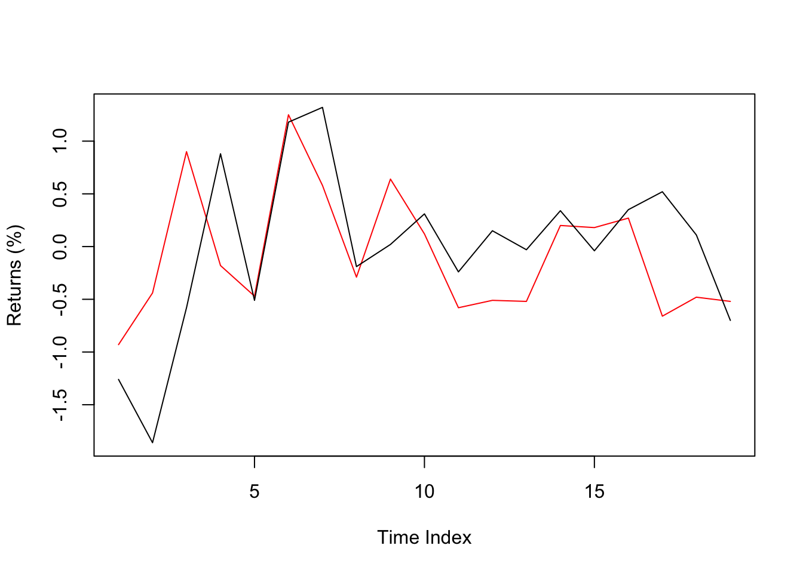
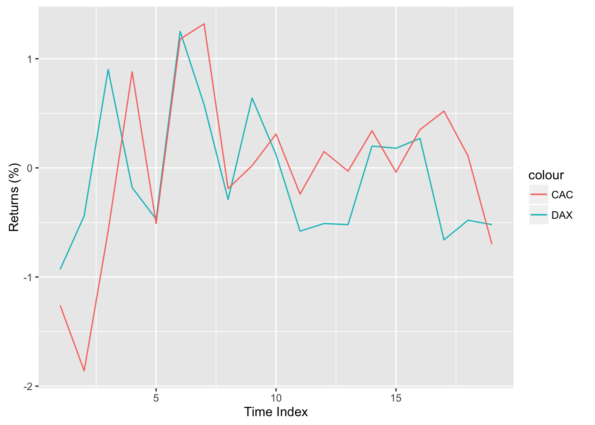

#Briefly About R

R is a scripting language^[Read as not compiled like C or C++. Line by line, you can run the code.] with the main purpose of conducting tasks related to statistics, mainly by academics for the academics. Though, these days things got slightly out of hand and R became one of the most popular languages especially in the field of "data science". The biggest advantage of R is the huge package (R equivalent of "There is an app for that") and developer support.

Other main points to know about R are as follows.

 + R is mainly based on vector operations.^[Currently, take it as a warning of "Do not use unnecessary loops (i.e. `for`) in your code."]
 + R inherently does not support parallel processing. (There are solutions but still frustrating.)
 + R does all the computations in the memory. A bit problematic for bigger data (>10M rows) applications, but there are solutions as well.
 + Even though R packages have magnificent reporting tools (e.g. This document is prepared using R Markdown.), it is not suitable for all purpose use such as Python (especially web development).
 + Package management is mainly done by CRAN repository. Though, these days there are many packages in other sources as well For instance, putting R packages on GitHub before CRAN for testing is quite popular.
 + There is a Microsoft version of R with additional abilities (It supports Mac and Linux, too).

A list of resources with links and explanations will be given at the end of this document.

#Getting Ready

 + Download R from this link https://cran.r-project.org/ (latest release is 3.3.1 as of Oct 6, 2016) and install. Make sure it is working.
 + Recommended to choose an editor (see R 101 below for alternatives).

#R 101

This part lays out the very basics of R. Content is mainly about data types (numeric, character and logical), object types (vectors, matrices, lists and ) and basic operations. Before starting check the following tips that can be useful.

 + Commenting the code is done with `#` for each line. There is no block comment like `/* */` used in C, but there are block commment keyboard shortcuts for most editors.
 + If you need information about any object just put `?` before the object. For example, try `?mean` to get information about the function `mean`.
 + You will need a good code editor or an IDE (Integrated Development Environment). Most popular choice of an IDE for R is [RStudio](https://www.rstudio.com/) (Remember to install R first). Recommended alternatives are [Atom](http://atom.io/) and [Sublime Text](https://www.sublimetext.com/) with proper add-ons.

##Value Assignment, Vectors and Data Types

Values can be defined on variables with the assignment operator `<-` or `=`.^[You can use either or both; there is only a small difference between those two.] For example let's assign a numeric value to the variable `x`.^[You can specifically define integer, double or complex numeric types. For the sake of simplicity let's use only numeric, for now.] You don't need to define a variable, assigning a value is enough.


```r
x <- 522
x
```

```
## [1] 522
```

Your can also assign character strings,


```r
x <- "FE522"
x
```

```
## [1] "FE522"
```

and logical. (There is also a factor type, but it is skipped for now.)


```r
x <- FALSE
x
```

```
## [1] FALSE
```

##Object Types

In this part, object types such as `vector`, `matrix`, `data.frame` and `list` are explained. Although this is not a complete list (e.g. `array` is another object type) and object is a more general concept, these object types are mostly sufficient at beginner and intermediate levels.

###Vector

Most basic data structure is a vector. You can create a simple vector with `c()` (**c**ombine).


```r
x <- c(5, 2, 2)
x
```

```
## [1] 5 2 2
```

You can change any value in a vector by defining its index. Index starts with 1.


```r
x[2] <- 7
x
```

```
## [1] 5 7 2
```

You can omit a value by putting a negative index.


```r
x[-2] <- 0
x
```

```
## [1] 0 7 0
```

R handles out of bounds index values and returns `NA`.


```r
x[5] <- 10
x
```

```
## [1]  0  7  0 NA 10
```

You can define multiple index values and define rules to choose the index.


```r
x2 <- 10:19  #This is a special representation that generates a vector from a (10) to b (19).
x2[c(1, 3, 7)]  #Return 1st, 3rd and 7th values.
```

```
## [1] 10 12 16
```

```r
x2[(1:3)]  #Return 1st to 3rd values.
```

```
## [1] 10 11 12
```


```r
x2[x2 > 15]  #Return the index values where x2 > 15
```

```
## [1] 16 17 18 19
```

```r
x2 > 15
```

```
##  [1] FALSE FALSE FALSE FALSE FALSE FALSE  TRUE  TRUE  TRUE  TRUE
```

You can give names instead of index values.


```r
x3 <- c(1, 2, 3)
names(x3) <- c("a1", "b2", "c3")
x3
```

```
## a1 b2 c3 
##  1  2  3
```

```r
x3["b2"]
```

```
## b2 
##  2
```

If you try to combine different data types, R will transform them to characters or numeric.


```r
c(5, FALSE)
```

```
## [1] 5 0
```

```r
c(5, FALSE, "FE522")
```

```
## [1] "5"     "FALSE" "FE522"
```

Mathematical operations can be easily done with vectors.


```r
vec1 <- 1:5  # This is a special representation of consecutive numbers.
vec1
```

```
## [1] 1 2 3 4 5
```

```r
vec2 <- vec1 * 2
vec2
```

```
## [1]  2  4  6  8 10
```

```r
vec1 + vec2
```

```
## [1]  3  6  9 12 15
```

Vectors need not to be of equal size (though recommended).


```r
vec1 <- 1:6
vec2 <- 3:5
vec1 + vec2
```

```
## [1]  4  6  8  7  9 11
```

### Matrix

Matrix is more like a stylized vector in a rectangular (matrix) format with some special functions.


```r
mat1 <- matrix(1:9, ncol = 3, nrow = 3)
mat1
```

```
##      [,1] [,2] [,3]
## [1,]    1    4    7
## [2,]    2    5    8
## [3,]    3    6    9
```

You can manipulate a value of a matrix by giving its index value.


```r
mat1[2, 2] <- -10
mat1
```

```
##      [,1] [,2] [,3]
## [1,]    1    4    7
## [2,]    2  -10    8
## [3,]    3    6    9
```

Here are some basic matrix operations.


```r
mat2 <- matrix(c(0, 4, 1, 2, 0, 0, 0, 0, 1), ncol = 3)
mat2
```

```
##      [,1] [,2] [,3]
## [1,]    0    2    0
## [2,]    4    0    0
## [3,]    1    0    1
```

```r
t(mat2)  # Transpose of a matrix
```

```
##      [,1] [,2] [,3]
## [1,]    0    4    1
## [2,]    2    0    0
## [3,]    0    0    1
```

```r
solve(mat2)  # Inverse of a matrix
```

```
##      [,1]  [,2] [,3]
## [1,]  0.0  0.25    0
## [2,]  0.5  0.00    0
## [3,]  0.0 -0.25    1
```

```r
det(mat2)  # Determinant value of a matrix
```

```
## [1] -8
```

```r
dim(mat2)  # Dimensions of a matrix
```

```
## [1] 3 3
```

```r
nrow(mat2)  # Number of rows of a matrix
```

```
## [1] 3
```

```r
ncol(mat2)  # Number of columns of a matrix
```

```
## [1] 3
```

```r
diag(mat2)  # Diagonal values of a matrix
```

```
## [1] 0 0 1
```

```r
eigen(mat2)  # Eigenvalues and eigenvectors of a matrix
```

```
## $values
## [1]  2.828427 -2.828427  1.000000
## 
## $vectors
##           [,1]       [,2] [,3]
## [1,] 0.5505553  0.5708950    0
## [2,] 0.7786028 -0.8073674    0
## [3,] 0.3011087 -0.1491200    1
```

```r
mat1 %*% mat2  # Matrix multiplication
```

```
##      [,1] [,2] [,3]
## [1,]   23    2    7
## [2,]  -32    4    8
## [3,]   33    6    9
```

You can also do vector operations with matrices.


```r
mat1 + mat2
```

```
##      [,1] [,2] [,3]
## [1,]    1    6    7
## [2,]    6  -10    8
## [3,]    4    6   10
```

```r
mat1 - mat2
```

```
##      [,1] [,2] [,3]
## [1,]    1    2    7
## [2,]   -2  -10    8
## [3,]    2    6    8
```

```r
mat1/mat2
```

```
##      [,1] [,2] [,3]
## [1,]  Inf    2  Inf
## [2,]  0.5 -Inf  Inf
## [3,]  3.0  Inf    9
```

```r
mat1 * mat2
```

```
##      [,1] [,2] [,3]
## [1,]    0    8    0
## [2,]    8    0    0
## [3,]    3    0    9
```

You can do operations with matrices and vectors together. Then matrix is treated like a vector with the index column order (i.e. starts from top to bottom, then goes to next column).


```r
mat3 <- matrix(1:9, ncol = 3)
mat3
```

```
##      [,1] [,2] [,3]
## [1,]    1    4    7
## [2,]    2    5    8
## [3,]    3    6    9
```

```r
vec <- c(0, 1, 0)
mat3 + vec
```

```
##      [,1] [,2] [,3]
## [1,]    1    4    7
## [2,]    3    6    9
## [3,]    3    6    9
```

```r
mat3 * vec
```

```
##      [,1] [,2] [,3]
## [1,]    0    0    0
## [2,]    2    5    8
## [3,]    0    0    0
```

You can name rows and columns of a matrix.


```r
rownames(mat3) <- c("a", "b", "c")
colnames(mat3) <- c("y1", "y2", "y3")
mat3
```

```
##   y1 y2 y3
## a  1  4  7
## b  2  5  8
## c  3  6  9
```

###Data Frame

Data frame is the most useful object type. Unlike matrix and vector you can define different data types for different columns.


```r
df1 <- data.frame(some_numbers = 1:3, some_names = c("Blood", 
    "Sweat", "Tears"), some_logical = c(TRUE, FALSE, TRUE))
df1
```

```
##   some_numbers some_names some_logical
## 1            1      Blood         TRUE
## 2            2      Sweat        FALSE
## 3            3      Tears         TRUE
```

You can see the details of an object (in this case the data frame) using `str()` function.


```r
str(df1)
```

```
## 'data.frame':	3 obs. of  3 variables:
##  $ some_numbers: int  1 2 3
##  $ some_names  : chr  "Blood" "Sweat" "Tears"
##  $ some_logical: logi  TRUE FALSE TRUE
```

You easily can do operations on a single column using `$`.


```r
df1$some_numbers
```

```
## [1] 1 2 3
```

```r
df1$some_names
```

```
## [1] "Blood" "Sweat" "Tears"
```

```r
df1$some_logical
```

```
## [1]  TRUE FALSE  TRUE
```

```r
df1$some_numbers <- df1$some_numbers^2
df1
```

```
##   some_numbers some_names some_logical
## 1            1      Blood         TRUE
## 2            4      Sweat        FALSE
## 3            9      Tears         TRUE
```

There are many example data sets in base R and packages in `data.frame` format. For instance, `EuStockMarkets` contains the closing prices of DAX (Germany), SMI (Switzerland), CAC (French), FTSE (UK) stock market indices.


```r
head(EuStockMarkets)  #head() function shows the first rows of a data frame.
```

```
##          DAX    SMI    CAC   FTSE
## [1,] 1628.75 1678.1 1772.8 2443.6
## [2,] 1613.63 1688.5 1750.5 2460.2
## [3,] 1606.51 1678.6 1718.0 2448.2
## [4,] 1621.04 1684.1 1708.1 2470.4
## [5,] 1618.16 1686.6 1723.1 2484.7
## [6,] 1610.61 1671.6 1714.3 2466.8
```

###List

Lists can hold many objects (including lists).


```r
list1 <- list(df1, mat3, vec2)
list1
```

```
## [[1]]
##   some_numbers some_names some_logical
## 1            1      Blood         TRUE
## 2            4      Sweat        FALSE
## 3            9      Tears         TRUE
## 
## [[2]]
##   y1 y2 y3
## a  1  4  7
## b  2  5  8
## c  3  6  9
## 
## [[3]]
## [1] 3 4 5
```

```r
list1[[1]]
```

```
##   some_numbers some_names some_logical
## 1            1      Blood         TRUE
## 2            4      Sweat        FALSE
## 3            9      Tears         TRUE
```

You can name the objects and call them with the names if you like.


```r
list1 <- list(some_df = df1, some_mat = mat3, vec2)
list1
```

```
## $some_df
##   some_numbers some_names some_logical
## 1            1      Blood         TRUE
## 2            4      Sweat        FALSE
## 3            9      Tears         TRUE
## 
## $some_mat
##   y1 y2 y3
## a  1  4  7
## b  2  5  8
## c  3  6  9
## 
## [[3]]
## [1] 3 4 5
```

```r
list1$some_df
```

```
##   some_numbers some_names some_logical
## 1            1      Blood         TRUE
## 2            4      Sweat        FALSE
## 3            9      Tears         TRUE
```

Lists are frequently used in functions as parameter set holders and for other purposes.

##Useful Base R Functions

Remember, you can always look for help for a function using `?function_name` or `help(function_name)`. This is not an exhaustive list, there are many other fantastic functions in base R.


```r
rep(x = 5, times = 10)  #Repeat a value or a vector
```

```
##  [1] 5 5 5 5 5 5 5 5 5 5
```

```r
seq(from = 5, to = 10, length.out = 11)  #Create a sequence with the given number of equidistant elements
```

```
##  [1]  5.0  5.5  6.0  6.5  7.0  7.5  8.0  8.5  9.0  9.5 10.0
```

```r
seq(from = 5, to = 10, by = 0.25)  #Create a sequence with the given increment value
```

```
##  [1]  5.00  5.25  5.50  5.75  6.00  6.25  6.50  6.75  7.00  7.25  7.50
## [12]  7.75  8.00  8.25  8.50  8.75  9.00  9.25  9.50  9.75 10.00
```

```r
vec1 <- sample(x = 1:10, size = 10, replace = FALSE)  #Pick 10 numbers randomly without replacement (Note: Your results might differ from this document due to randomness.)
vec1
```

```
##  [1]  8  4  6  1  5  2  9  7  3 10
```

```r
print(vec1/2)  #Print the outputs of an object. Useful for later.
```

```
##  [1] 4.0 2.0 3.0 0.5 2.5 1.0 4.5 3.5 1.5 5.0
```

```r
rev(vec1)  #Reverse of a vector
```

```
##  [1] 10  3  7  9  2  5  1  6  4  8
```

```r
length(vec1)  #Number of elements of a vector
```

```
## [1] 10
```

```r
vec1%%2  #Mod 2 of the elements in the vector
```

```
##  [1] 0 0 0 1 1 0 1 1 1 0
```

```r
min(vec1)  #Minimum value of the vector
```

```
## [1] 1
```

```r
max(vec1)  #Maximum value of the vector
```

```
## [1] 10
```

```r
factorial(vec1)  #Factorial value of all elements of a vector (You can use a single value as well)
```

```
##  [1]   40320      24     720       1     120       2  362880    5040
##  [9]       6 3628800
```

```r
sum(vec1)  #Sum of all the values in the vector
```

```
## [1] 55
```

```r
cumsum(vec1)  #Cumulative sum of all the values in the vector
```

```
##  [1]  8 12 18 19 24 26 35 42 45 55
```

```r
prod(vec1)  #Product (multiplication) of all the values in the vector
```

```
## [1] 3628800
```

```r
cumprod(vec1)  #Cumulative product of all the values in the vector
```

```
##  [1]       8      32     192     192     960    1920   17280  120960
##  [9]  362880 3628800
```

```r
log(vec1)  #Natural logarithm of the values in the vector
```

```
##  [1] 2.0794415 1.3862944 1.7917595 0.0000000 1.6094379 0.6931472 2.1972246
##  [8] 1.9459101 1.0986123 2.3025851
```

```r
log(vec1, base = 2)  #Logarithm of base 2.
```

```
##  [1] 3.000000 2.000000 2.584963 0.000000 2.321928 1.000000 3.169925
##  [8] 2.807355 1.584963 3.321928
```

```r
exp(vec1)  #Exponential values of a vector (e=2.71...)
```

```
##  [1]  2980.957987    54.598150   403.428793     2.718282   148.413159
##  [6]     7.389056  8103.083928  1096.633158    20.085537 22026.465795
```

```r
vec1^2  #Power of 2
```

```
##  [1]  64  16  36   1  25   4  81  49   9 100
```

```r
sqrt(vec1)  #Square root
```

```
##  [1] 2.828427 2.000000 2.449490 1.000000 2.236068 1.414214 3.000000
##  [8] 2.645751 1.732051 3.162278
```

```r
vecx <- c(1, 3, 5, 7)  #Define another vector
vecy <- c(8, 6, 4, 2)  #Define another vector
pmax(vecx, vecy)  #Maximum of each corresponding element of two (or more) vectors
```

```
## [1] 8 6 5 7
```

```r
pmin(vecx, vecy)  #Minimum of each corresponding element of two (or more) vectors
```

```
## [1] 1 3 4 2
```

```r
max(vecx, vecy)  #Difference between max and pmax
```

```
## [1] 8
```

```r
vec1 <- c(-1, 0.5, -1.2, 4/3)
vec1
```

```
## [1] -1.000000  0.500000 -1.200000  1.333333
```

```r
abs(vec1)  #Absolute value
```

```
## [1] 1.000000 0.500000 1.200000 1.333333
```

```r
round(vec1, digits = 1)  #Round a value to a number of digits
```

```
## [1] -1.0  0.5 -1.2  1.3
```

```r
floor(vec1)  #Round down value of vector
```

```
## [1] -1  0 -2  1
```

```r
ceiling(vec1)  #Round up value of vector
```

```
## [1] -1  1 -1  2
```

```r
round(0.5)  #Interesting case about rounding. Compare with below.
```

```
## [1] 0
```

```r
round(1.5)  #Interesting case about rounding. Compare with above.
```

```
## [1] 2
```

```r
vec_table <- sample(letters[1:5], 20, replace = TRUE)  #Another vector for frequency tables. letters is a predefined object in R.
vec_table
```

```
##  [1] "e" "a" "d" "e" "b" "b" "b" "c" "a" "c" "d" "d" "c" "c" "e" "c" "a"
## [18] "d" "d" "d"
```

```r
table(vec_table)  #Easily do a frequency table.
```

```
## vec_table
## a b c d e 
## 3 3 5 6 3
```

###Sorting, Ranking and Ordering


```r
vec2 <- sample(x = 11:20, size = 10, replace = FALSE)
vec2
```

```
##  [1] 19 18 16 15 17 13 20 12 14 11
```

```r
sort(vec2)  #Sort the values in the vector
```

```
##  [1] 11 12 13 14 15 16 17 18 19 20
```

```r
rank(vec2)  #Rank of the values in the vector
```

```
##  [1]  9  8  6  5  7  3 10  2  4  1
```

```r
order(vec2)  #Returns the index values (ascending) of the sorted vector.
```

```
##  [1] 10  8  6  9  4  3  5  2  1  7
```

```r
order(vec2, decreasing = TRUE)  #Returns the index values (descending) of the sorted vector.
```

```
##  [1]  7  1  2  5  3  4  9  6  8 10
```

###Logical operators

These operators return TRUE or FALSE values. They are especially useful to


```r
vec1 <- 1:10
vec1
```

```
##  [1]  1  2  3  4  5  6  7  8  9 10
```

```r
vec1 > 5  #Logical (TRUE/FALSE) result of elements greater than 5.
```

```
##  [1] FALSE FALSE FALSE FALSE FALSE  TRUE  TRUE  TRUE  TRUE  TRUE
```

```r
vec1[vec1 > 5]
```

```
## [1]  6  7  8  9 10
```

```r
vec1 >= 5  #Logical result of elements greater than or equal to 5.
```

```
##  [1] FALSE FALSE FALSE FALSE  TRUE  TRUE  TRUE  TRUE  TRUE  TRUE
```

```r
vec1[vec1 >= 5]
```

```
## [1]  5  6  7  8  9 10
```

```r
vec1 < 5  #Logical result of elements less than 5.
```

```
##  [1]  TRUE  TRUE  TRUE  TRUE FALSE FALSE FALSE FALSE FALSE FALSE
```

```r
vec1 <= 5  #Logical result of elements less than or equal to 5.
```

```
##  [1]  TRUE  TRUE  TRUE  TRUE  TRUE FALSE FALSE FALSE FALSE FALSE
```

```r
vec1 > 5 & vec1 < 9  #and (&) operator
```

```
##  [1] FALSE FALSE FALSE FALSE FALSE  TRUE  TRUE  TRUE FALSE FALSE
```

```r
vec1[vec1 > 5 & vec1 < 9]
```

```
## [1] 6 7 8
```

```r
vec1 < 5 | vec1 > 9  #or (|) operator
```

```
##  [1]  TRUE  TRUE  TRUE  TRUE FALSE FALSE FALSE FALSE FALSE  TRUE
```

```r
vec1[vec1 < 5 | vec1 > 9]
```

```
## [1]  1  2  3  4 10
```

You can also do element by element comparisons of two vectors.


```r
eu_df <- data.frame(EuStockMarkets[1:20, ])  #Take the first 20 rows of the stock market index data
eu_df_returns <- data.frame(DAX = 100 * (round(eu_df$DAX[-1]/eu_df$DAX[-20], 
    4) - 1), CAC = 100 * (round(eu_df$CAC[-1]/eu_df$CAC[-20], 
    4) - 1))  #Calculate the index percentage returns
eu_df_returns$DAX_or_CAC <- eu_df_returns$DAX >= eu_df_returns$CAC  #If the return of DAX is larger than or equal to CAC return TRUE
eu_df_returns
```

```
##      DAX   CAC DAX_or_CAC
## 1  -0.93 -1.26       TRUE
## 2  -0.44 -1.86       TRUE
## 3   0.90 -0.58       TRUE
## 4  -0.18  0.88      FALSE
## 5  -0.47 -0.51       TRUE
## 6   1.25  1.18       TRUE
## 7   0.58  1.32      FALSE
## 8  -0.29 -0.19      FALSE
## 9   0.64  0.02       TRUE
## 10  0.12  0.31      FALSE
## 11 -0.58 -0.24      FALSE
## 12 -0.51  0.15      FALSE
## 13 -0.52 -0.03      FALSE
## 14  0.20  0.34      FALSE
## 15  0.18 -0.04       TRUE
## 16  0.27  0.35      FALSE
## 17 -0.66  0.52      FALSE
## 18 -0.48  0.11      FALSE
## 19 -0.52 -0.70       TRUE
```

###Statistics Functions

Some functions are predefined to facilitate statistics calculations.


```r
vec1 <- sample(1:20, 50, replace = TRUE)  #Sample 50 numbers from values between 1 to 20
vec1
```

```
##  [1] 17  3 10  3 18  3 11  7 10 14  2  8 16 15 15 11 12  2  8  5  3 20 19
## [24] 15  5  2 18  1 11 18  7 10 20 14 15  9 18 10 17 11 10 16  4  8 10 16
## [47]  7  5 12 18
```

```r
mean(vec1)  #Mean
```

```
## [1] 10.78
```

```r
median(vec1)  #Median
```

```
## [1] 10.5
```

```r
var(vec1)  #Variance
```

```
## [1] 31.44041
```

```r
sd(vec1)  #Standard deviation
```

```
## [1] 5.607175
```

```r
quantile(vec1)  #Quantile values
```

```
##    0%   25%   50%   75%  100% 
##  1.00  7.00 10.50 15.75 20.00
```

```r
quantile(vec1, 0.65)  #Quantile value of a specific percentage
```

```
## 65% 
##  14
```

```r
summary(vec1)  #An aggregate summary
```

```
##    Min. 1st Qu.  Median    Mean 3rd Qu.    Max. 
##    1.00    7.00   10.50   10.78   15.75   20.00
```

There are also random number generators and functions related with densities and cdf's of different distributions. Here are the functions for normal distribution.


```r
rnorm(5, mean = 0, sd = 1)  #Generate 5 normally distributed random numbers with mean 0 and sd 1
```

```
## [1]  0.5235377  0.5120292  0.8016673 -2.0428315  1.2432825
```

```r
dnorm(x = 0, mean = 0, sd = 1)  #Density value of a point in a normal distribution with mean 0 and sd 1
```

```
## [1] 0.3989423
```

```r
pnorm(q = 1.96, mean = 0, sd = 1)  #Cumulative distribution value of a point in a normal distribution with mean 0 and sd 1
```

```
## [1] 0.9750021
```

```r
qnorm(p = 0.975, mean = 0, sd = 1)  #Quantile value of a point in a normal distribution with mean 0 and sd 1
```

```
## [1] 1.959964
```

Other distributions include `dpois` (poisson), `dbinom` (binomial), `dgeom` (geometric), `dunif` (uniform), `dgamma` (gamma), `dexp` (exponential), `dchisq` (chi-squared), `dt` (t distribution), `df` (F distribution), `dcauchy` (cauchy),`dnbinom` (negative binomial), `dhyper` (hypergeometric), `dlnorm` (lognormal), `dbeta` (beta), `dlogis` (logistic) and `dweibull` (weibull) with the same format (e.g. `rpois` generates random poisson numbers).

####Random Number Generation

**Tip:** For reproducibility use `set.seed`. It will set the randomness seed to a value and random number generation will be the same for (almost) everyone.


```r
set.seed(522)
rnorm(10)
```

```
##  [1]  0.52028245  0.75354770 -0.80932517 -0.42112173  0.08458416
##  [6]  1.80153605  1.25071091 -0.31097287  1.16377544 -0.67728655
```

Let's run it a second time by resetting the seed. The output will be the same.


```r
set.seed(522)
rnorm(10)
```

```
##  [1]  0.52028245  0.75354770 -0.80932517 -0.42112173  0.08458416
##  [6]  1.80153605  1.25071091 -0.31097287  1.16377544 -0.67728655
```

See, the same output happens when randomness seed is restarted at the same value.

###Conversion between data and object types

You can convert numeric to character, logical to numeric using functions starting with `as.` and check the type of the object with `is.` or `typeof()`.


```r
vec1 <- c(1, 2, 3, 4)
is.numeric(vec1)  #Is the vector numeric?
```

```
## [1] TRUE
```

```r
as.character(vec1)  #Make the vector character?
```

```
## [1] "1" "2" "3" "4"
```

```r
typeof(vec1)  #What is the type?
```

```
## [1] "double"
```

```r
vec2 <- c("a", "b", "c", "d")
typeof(vec2)
```

```
## [1] "character"
```

```r
as.numeric(vec2)  # oops
```

```
## Warning: NAs introduced by coercion
```

```
## [1] NA NA NA NA
```

```r
vec3 <- c(TRUE, FALSE, TRUE, FALSE)
is.logical(vec3)
```

```
## [1] TRUE
```

```r
as.numeric(vec3)
```

```
## [1] 1 0 1 0
```

```r
as.character(vec3)
```

```
## [1] "TRUE"  "FALSE" "TRUE"  "FALSE"
```

```r
vec3 * 1  #Convert to numeric with multiplication
```

```
## [1] 1 0 1 0
```

```r
df1 <- data.frame(a = c(1, 2, 3), b = c(4, 5, 6), c = c(7, 8, 
    9))
as.matrix(df1)  #Convert to matrix
```

```
##      a b c
## [1,] 1 4 7
## [2,] 2 5 8
## [3,] 3 6 9
```

```r
mat1 <- matrix(1:9, ncol = 3)
as.data.frame(mat1)
```

```
##   V1 V2 V3
## 1  1  4  7
## 2  2  5  8
## 3  3  6  9
```

###String Manipulation


```r
strvec1 <- c("FE522", "FE511", "IE422")
grep("FE", strvec1)  #Index values of character strings including FE
```

```
## [1] 1 2
```

```r
grepl("FE", strvec1)  #TRUE FALSE statements of character strings including FE
```

```
## [1]  TRUE  TRUE FALSE
```

```r
gsub("FE", "IE", strvec1)  #Replacing strings
```

```
## [1] "IE522" "IE511" "IE422"
```

```r
nchar(strvec1)  #Return number of characters in string
```

```
## [1] 5 5 5
```

```r
substr(strvec1, start = 1, stop = 2)  #Trim the string from start to stop
```

```
## [1] "FE" "FE" "IE"
```

```r
paste("FE", "522", sep = "-")  #Concatenate two strings with a separator.
```

```
## [1] "FE-522"
```

```r
paste0("FE", "522")  #Concatenate two strings without a separator, equivalent of paste(.,sep='').
```

```
## [1] "FE522"
```

```r
paste(strvec1, collapse = "+")  #Concatenate elements of a vector with a collapse character.
```

```
## [1] "FE522+FE511+IE422"
```

##Conditionals (If-Else)

Conditionals are straightforward. If a statement returns `TRUE`, then the code chunk defined by the brackets are executed.


```r
course_name <- "FE522"  #Define the course name.

if (course_name == "FE522") {
    # If the course name is FE522.
    print("Correct course.")
}
```

```
## [1] "Correct course."
```

It is possible to execute some other code chunk if the statement is `FALSE` with `else` and add other conditionals using `else if`.


```r
course_name <- "FE511"  #Define the course name.

if (course_name == "FE522") {
    # If the course name is FE522.
    print("Correct course.")
} else if (grepl("FE", course_name)) {
    # If the course name include FE but it is not FE522.
    print("Wrong course but close.")
} else {
    # If none of the above
    print("Wrong course.")
}
```

```
## [1] "Wrong course but close."
```

`if` conditional statements accept only one value. If you want to check for all elements in a vector use `ifelse()`.


```r
course_name <- c("FE522", "FE511", "IE422")
ifelse(course_name == "FE522", "Correct Course", "Wrong Course")
```

```
## [1] "Correct Course" "Wrong Course"   "Wrong Course"
```

##Loops

Although you are warned that R works slowly with loops (especially loops within loops), it is usually inevitable to use the loops.

### For

For loops consist of a loop variable and a scope.


```r
val <- 2
for (i in 1:3) {
    # Define the loop variable and scope
    print(val^i)
}
```

```
## [1] 2
## [1] 4
## [1] 8
```

Scope does not need to be numbers. For returns whatever in the scope in index order


```r
for (i in c("FE522", "FE511", "IE422")) {
    print(i)
}
```

```
## [1] "FE522"
## [1] "FE511"
## [1] "IE422"
```

### While

While is a less frequently used loop type. It repeats the code while a condition is met. It first checks the condition. When it is not satisfied, it skips the code chunk.


```r
x <- 0
while (x < 3) {
    x <- x + 1
    print(paste0("x is ", x, " x is not at the desired level. Desired level is above 3."))
}
```

```
## [1] "x is 1 x is not at the desired level. Desired level is above 3."
## [1] "x is 2 x is not at the desired level. Desired level is above 3."
## [1] "x is 3 x is not at the desired level. Desired level is above 3."
```

##Functions

R lets you to define functions easily, with a flexible format. Here are some examples.


```r
fun1 <- function(par1 = "This is a default value") {
    print(par1)
}
```
If there is a default value defined on the function you do not need to enter any value if you are comfortable with.

```r
fun1()
```

```
## [1] "This is a default value"
```
You can change the parameters when you call the function.

```r
fun1(par1 = "Congratulations, you changed the parameter.")
```

```
## [1] "Congratulations, you changed the parameter."
```
If you are careful about the order of your entered parameters, you do not need to write the parameter name.

```r
fun1("Wow you do it like a pro without parameter names!")
```

```
## [1] "Wow you do it like a pro without parameter names!"
```

Here is another simple example. Let's calculate the future value of an initial investment compounded interest.


```r
calc_future_value <- function(present_value, interest_rate, years) {
    return(present_value * (1 + interest_rate)^years)
}
calc_future_value(100, 0.05, 5)
```

```
## [1] 127.6282
```

Put a technical analysis.

##Input Output (I/O) Operations

Reading from and writing to data files will be unavoidable at some point. While it is useful to know the fundamental functions, I/O operations usually require experience. In other words, you will face many challenges to read a table from an excel file or writing outputs to txt files. Though, it gets easier

Frequently use the help of these functions to understand their inner workings. For `xlsx` files and other data types (e.g. JSON, SQL) there are packages.


```r
setwd("~/some_path")  #Set working directory path.
getwd()  #Get the working directory path.
scan(file = "some_data_file.txt")  #Read data from file.
read.table(file = "some_data_file.csv")  #Read xls or csv files but not xlsx files. You will need a package for that.
source("path_to_some_r_file/some_r_file.r")
write("writing_something", file = "some_document_file.txt")
write.table()  #Writing to csv or xls. Similar logic to to read.table with opposite function.
file.choose()  #Manually choosing a file from computer. You can use it like read.table(file.choose())
dir(path = "some_path")  #Files in the path directory.
```

Important: Defining paths in R can be different in Windows and Mac. See [this link](https://cran.r-project.org/bin/windows/base/rw-FAQ.html#What-are-HOME-and-working-directories_003f) for more detail.


```r
dir("C:/Desktop/")  #Windows style 1
dir("C:\\Desktop\\")  #Windows style 2
dir("~/Documents/")  #Mac and Linux style. Might work for Windows too.
```

Tip: Sometimes, R reads columns containing characters as `factor` data type. It is not covered in this tutorial and it is tough to handle and convert. Therefore using the following code will prevent R to read character strings as factors.


```r
options(stringsAsFactors = FALSE)
```

If your character vector is read as a factor, use `as.character()` function. If your numeric vector is read as a factor, use `as.numeric(as.character())` function. Examples are given below.


```r
factvec <- factor(c("a", "b", "c", "a"))  #Factor data vector
factvec
as.character(factvec)  #Convert to character
factvec2 <- factor(c(10, 20, 30, 40, 10))  #Factor data vector with numbers only
factvec2
as.numeric(factvec2)  #If you want to convert directly to numeric, output will not be desirable.
as.numeric(as.character(factvec2))
```

###RData

RData is a special data file type used by R. It is quite useful and efficient to store (better than csv). One disadvantage is it is not as common as csv, so reading RData outside R is a challenge.


```r
load(path = "some_RData")
save(some_data_frame, file = "some_file.RData")
```

##Packages

Packages are the most important asset class of R. These last years have seen a rapid expansion of R packages for almost any topic of interest that need computation. There are two steps to use a package; to install and to load.


```r
install.packages("package_name")  #Install command
library(package_name)  #Load the package require() also works. No quotes!
```

**Remember:** You need to install a package only once. It is downloaded and ready to use whenever you load the package with `library()`. Packages are updated from time to time. To update your installed packages, use `update.packages()` command.

Below displays an example of a package use from the start. You will see how it is done in base R and how it can be enhanced with the packages.

###Plotting

Plotting in R can be a bit problematic and hard. Let's plot the returns of stock indexes of the previous `EuStockMarkets` data.


```r
# Let's redo what we did previously.
eu_df <- data.frame(EuStockMarkets[1:20, ])  #Take the first 20 rows of the stock market index data
eu_df_returns <- data.frame(DAX = 100 * (round(eu_df$DAX[-1]/eu_df$DAX[-20], 
    4) - 1), CAC = 100 * (round(eu_df$CAC[-1]/eu_df$CAC[-20], 
    4) - 1))  #Calculate the index percentage returns
eu_df_returns
```

```
##      DAX   CAC
## 1  -0.93 -1.26
## 2  -0.44 -1.86
## 3   0.90 -0.58
## 4  -0.18  0.88
## 5  -0.47 -0.51
## 6   1.25  1.18
## 7   0.58  1.32
## 8  -0.29 -0.19
## 9   0.64  0.02
## 10  0.12  0.31
## 11 -0.58 -0.24
## 12 -0.51  0.15
## 13 -0.52 -0.03
## 14  0.20  0.34
## 15  0.18 -0.04
## 16  0.27  0.35
## 17 -0.66  0.52
## 18 -0.48  0.11
## 19 -0.52 -0.70
```

Base R plotting is as following.


```r
plot(x = 1:nrow(eu_df_returns), y = eu_df_returns$DAX, type = "l", 
    col = "red", ylim = c(min(unlist(eu_df_returns)), max(unlist(eu_df_returns))), 
    ylab = "Returns (%)", xlab = "Time Index")
lines(eu_df_returns$CAC)
```



You can probably do better with `ggplot2` package. It has more beautiful aesthetics, more readable code and better options. Even with the default values your plots will look better. Here is a simple implementation of the previous example.


```r
if (!("ggplot2" %in% rownames(installed.packages()))) {
    install.packages("ggplot2")  #Install the package (you can skip it if it is already installed)
}
library(ggplot2)
ggplot(data = eu_df_returns, aes(x = 1:nrow(eu_df_returns))) + 
    geom_line(aes(y = DAX, color = "DAX")) + geom_line(aes(y = CAC, 
    color = "CAC")) + labs(x = "Time Index", y = "Returns (%)")
```



##Recommendations

R is quite extensive and the best ways to quickly learn are to write as much code as possible (this is the boring advice) and expose yourself to information by subscribing to newsletters, following related Twitter accounts and Facebook pages. Some prominently beneficial sources are given below.

[R CRAN Task View](https://cran.r-project.org/web/views/): Curated lists of packages categorized on the purpose of use. They have categories such as Finance, Time Series and Econometrics. It is a good way to start searching for packages.

[Stackexchange](http://stackexchange.com/): Programmer's best friend. It is the umbrella site for highly technical Q\&A sites such as [Stack Overflow](http://stackoverflow.com/) (for general programming), [Cross Validated](http://stats.stackexchange.com/) (statistics and data science) and [Quantitative Finance](http://quant.stackexchange.com/). You can ask your programming problems here by providing an MWE (minimal working example)

[Kaggle](http://kaggle.com/): There are many data science tasks, data sets and codes in here. Known for data competitions.

[Quandl](http://quandl.com/): Vast collection of data sets mainly on economics and finance. Great R support (even has a package).

[GitHub](https://github.com/): Most popular online code repository for git^[Git is a version controlling system mainly for software development but basically for any project. It mainly replaces the practice of code_finalfinalfinal.r and finalreport_lastlastlastthisisthelastipromise.docx] based projects. Plus, putting R packages on GitHub prior to release on CRAN is a popular practice (advanced topic).

[Coursera](https://www.coursera.org/): Online learning at its best. There are many good quality quantitative finance, R and data science courses in here.

[R-bloggers](https://www.r-bloggers.com): Very useful site about R. I personally recommend subscribing to their newsletter and following their Twitter and Facebook accounts.

[R-SIG-FIN](https://stat.ethz.ch/mailman/listinfo/r-sig-finance): A mail group about R and Finance. A bit outdated but you can still search the archives.

[ROpenSci](http://ropensci.org/): An organization promoting reproducible research with R. They have many good packages also.

###R Cheat Sheets

There are many code cheat sheets on the internet. Here are some. I will update the list with new additions.

[RStudio Cheat Sheets](https://www.rstudio.com/resources/cheatsheets/): Cheat sheets on base R, plotting and some very useful packages (i.e. `dplyr`, `ggplot2`, `shiny`, `rmarkdown`).

[Data Management](https://sites.ualberta.ca/~ahamann/teaching/renr690/R_Cheat_Data.pdf)

[Quandl Cheat Sheet](https://s3.amazonaws.com/quandl-static-content/Documents/Quandl+-+R+Cheat+Sheet.pdf): A cheat sheet by Quandl. There are also tips to use the `quandl` package.

[R Reference Card](https://cran.r-project.org/doc/contrib/Short-refcard.pdf): This one is from official R site.

[Google's R Style Guide](https://google.github.io/styleguide/Rguide.xml): This is more about styling your code. Best practices for readability.
<!--

Add correlation to statistics part


-->
